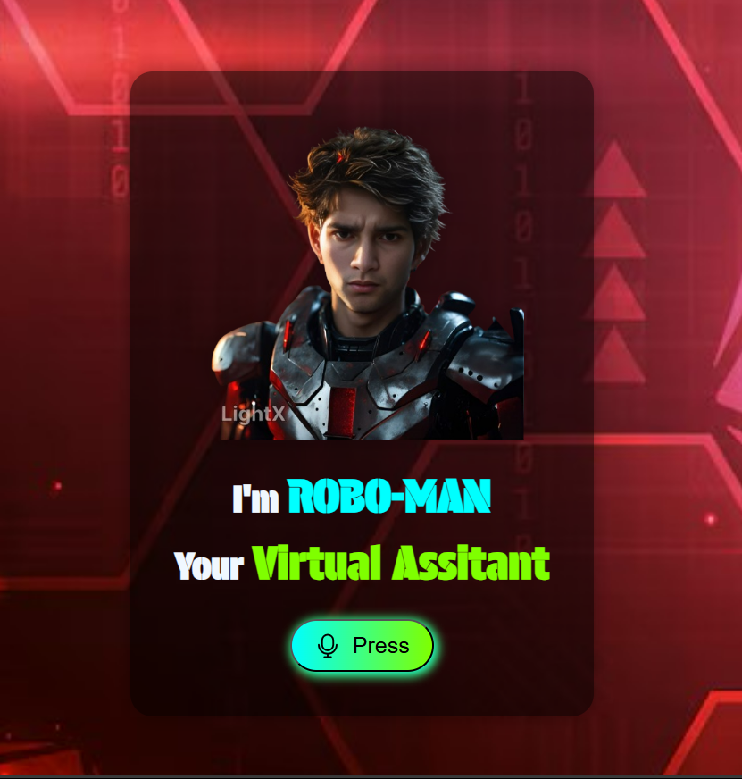

# 🤖 Robo-Man — Virtual Assistant

**Robo-Man** is a simple, interactive, voice-powered virtual assistant built using HTML, CSS, and JavaScript. This browser-based assistant can listen to your voice commands and respond with relevant actions or messages. It's an engaging project for beginners to explore the Web Speech API and practice modern UI design.

## 🚀 Features

- 🎙️ Voice command recognition using Web Speech API  
- 🗣️ Text-to-speech responses using SpeechSynthesis  
- 💡 Sleek and colorful UI with modern fonts and animations  
- 🎧 Voice activity GIF indicator  
- 🖱️ Interactive microphone button with hover effects  
- ⚙️ Simple and lightweight — no frameworks needed  

## 🧰 Tech Stack

- **HTML5** – structure  
- **CSS3** – styling and layout  
- **JavaScript (Vanilla)** – voice processing and interaction logic  
- **Web Speech API** – voice recognition and speech synthesis  
- **Google Fonts** – custom typography  
- **Lottie / GIFs** – visual feedback for voice activity  

## 📸 Screenshots

## 📁 Folder Structure

Robo-Man/
├── images/ # Logo, background, and voice GIF
│ ├── mann2.png
│ ├── bg.jpg
│ └── voice.gif
├── index.html
├── index.css
├── index.js
├── mic.svg # Microphone icon
├── README.md

## 🗣️ How to Use

1. Clone the repo or download the files  
2. Open `index.html` in your browser  
3. Click on the microphone button labeled **"Hit Me Up"**  
4. Speak your command  
5. The assistant will respond accordingly  

## 📝 Example Commands

- "Hello Robo-Man"  
- "What is your name?"  
- "How are you today?"  
- "What time is it?"  
- "Open Google"  
- "Open YouTube"  
- "Open GitHub"  
- "Search for weather updates"  
- "Tell me a fun fact"  
- "Play music on YouTube"  
- "Go to Instagram"  
- "Can you open LinkedIn?"  
- "What is today's date?"  
- "Search ChatGPT on Google"  

## 📦 Future Enhancements

- 🌐 Integrate with real-time APIs (e.g., weather, news, AI chat responses)  
- 🎵 Add media controls like playing music or videos using voice  
- 🧠 Smarter NLP using OpenAI or Dialogflow for natural conversations  
- 📱 Make the UI fully responsive and mobile-friendly  
- 🌗 Add dark/light theme toggle 

## 🙋‍♂️ About Me

This project was created by **Man Gautam**, a CSE Graduated passionate about AI, frontend development, and building smart, interactive web experiences.

- [GitHub](https://github.com/mangautam27)  
- [LinkedIn](https://www.linkedin.com/in/27man)

## 📄 License

This project is open-source and available under the [MIT License](LICENSE).
